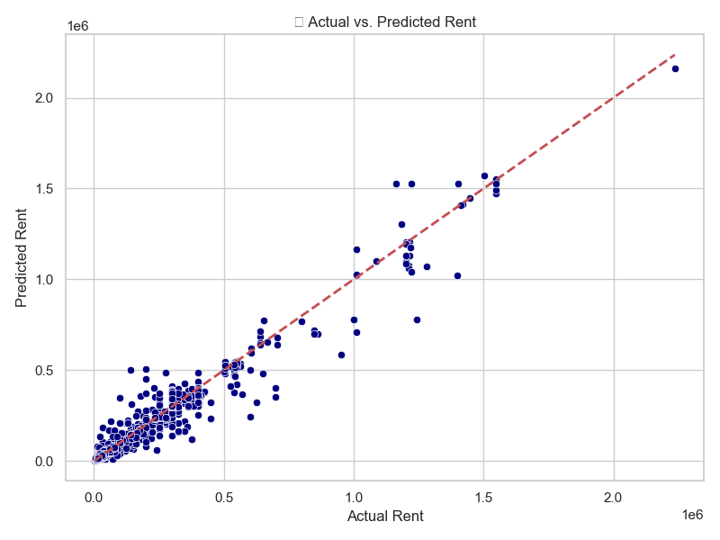
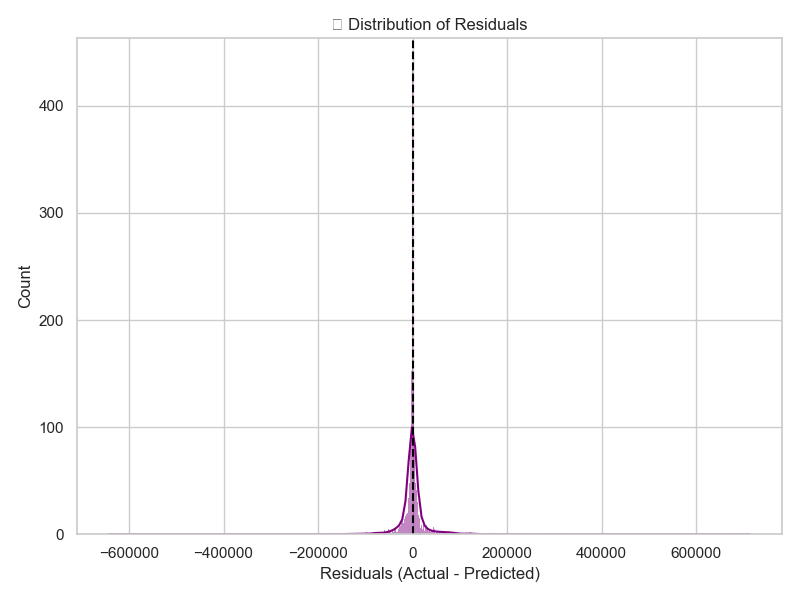

# Rental Price Recommendation System for Urban Areas

A data-driven machine learning solution to **predict residential rental prices** in major Indian cities — **Delhi, Mumbai, and Pune** — based on features such as property area, square footage, type, furnishing status, and more.

> **Note:** This project is based on **publicly available historical rental data** from Kaggle and may not reflect current market prices. However, the pipeline and model are fully customizable to accommodate updated or real-time data sources.

---

## Overview

With rising urban housing demand, accurately estimating fair rental prices is a major challenge. This project aims to simplify the process by using machine learning models trained on historical rental listings to predict monthly rent prices.

---

## Key Features

- **EDA from MySQL Database**
  Interactive and visual exploration of structured rental data.

- **Robust Preprocessing Pipeline**
  Encoding, scaling, and imputing missing data using `scikit-learn` pipelines.

- **Model Training and Evaluation**
  Comparison of multiple regression models to select the most accurate one.

- **Reusable Model & Pipeline**
  Models saved with `joblib` for seamless integration and deployment.

- **Interactive Streamlit App**
  User-friendly interface to predict rental prices from custom inputs.

- **Visual Diagnostics**
  Plots for Actual vs Predicted prices and Residual error distribution.

---

## Tech Stack

| Tool                    | Purpose                          |
| ----------------------- | -------------------------------- |
| **Python**              | Core programming language        |
| **MySQL**               | Backend database for rental data |
| **Pandas, NumPy**       | Data manipulation and analysis   |
| **Scikit-learn**        | Machine learning pipeline        |
| **Matplotlib, Seaborn** | Data visualization               |
| **Joblib**              | Model and pipeline serialization |
| **Streamlit**           | Web-based rent prediction app    |

---

## Project Structure

```
rental-price-recommender/
│
├── data/
│   ├── X_train.pkl, X_test.pkl
│   ├── y_train.pkl, y_test.pkl
│
├── models/
│   ├── preprocessing_pipeline.pkl
│   ├── best_model.pkl
│
├── plots/
│   ├── actual_vs_predicted.png
│   ├── residuals_distribution.png
│
├── src/
│   ├── db_connect.py              # MySQL connection utility
│   ├── eda_sql.py                 # Data exploration and cleaning
│   ├── preprocessing_sql.py       # Data transformation pipeline
│   ├── train_model_comparison.py  # Model training and comparison
│   ├── evaluate_model.py          # Evaluation and performance analysis
│   ├── predict.py                 # CLI-based prediction interface
│   ├── visualize_results.py       # Diagnostic plots
│
├── app.py                         # Streamlit application
├── requirements.txt
└── README.md
```

---

## Setup Instructions

```bash
# 1. Clone the repository
git clone https://github.com/Aditi-1304/rental-price-recommender.git
cd rental-price-recommender

# 2. Create a virtual environment and activate it
python -m venv venv
venv\Scripts\activate  # On Windows

# 3. Install the required packages
pip install -r requirements.txt

# 4. Train the models and evaluate
python src/train_model_comparison.py
python src/evaluate_model.py

# 5. Run a sample prediction via CLI
python src/predict.py

# 6. Launch the Streamlit App
streamlit run app.py
```

---

## Results

| Model             | RMSE (₹)  | R² Score  |
| ----------------- | --------- | --------- |
| Linear Regression | 58,836.01 | 0.8946    |
| Random Forest     | 36,676.88 | 0.9590    |
| Gradient Boosting | 45,168.99 | 0.9379    |
| KNN Regressor     | 43,529.06 | 0.9423    |
| XGBoost           | 40,364.53 | 0.9504    |
| LightGBM          | 43,513.69 | 0.9424    |

**Best Performing Model:** Random Forest
**Mean Absolute Error (MAE):** ₹13,680.08

<div align="center">

 <br>


</div>

---

## Sample Prediction

```bash
🏠 Area: Kothrud, Pune
📐 Size: 1200 sq ft, 2 BHK
🏗️ Type: Apartment, Semi-Furnished
💰 Security Deposit: ₹30,000

➡️ Predicted Rent: ₹38,200/month
```

---

## Deployment Readiness

The project includes a deployable Streamlit app (`app.py`) for live predictions. It can be hosted on:

- [Streamlit Community Cloud](https://streamlit.io/cloud) – Ideal for quick deployment (free tier available)
- Hugging Face Spaces (Gradio/Streamlit interface)
- Self-hosted via Heroku, Render, or Railway

---

## Future Enhancements

- Integrate **geospatial features** (e.g., proximity to metro, landmarks)
- Build **automated data update pipeline** (ETL)
- Add **Explainable AI** (SHAP, LIME) for model transparency
- Implement **CI/CD** for seamless updates and testing

---

## Disclaimer

This project uses historical rental listing data available from Kaggle.
**The predictions may not reflect the current real-estate market**, and should be used for educational or prototype purposes only. You can **retrain the model with newer datasets** to make the system more up-to-date.
